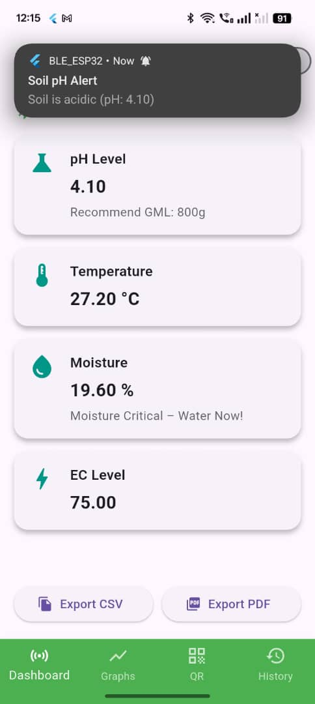
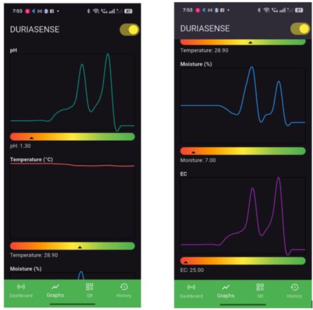
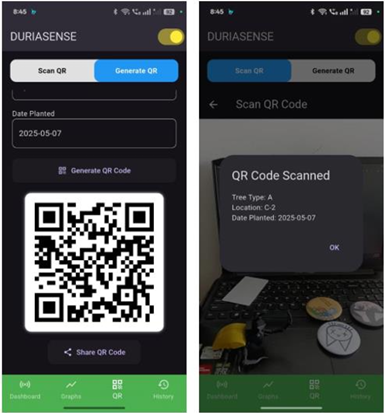
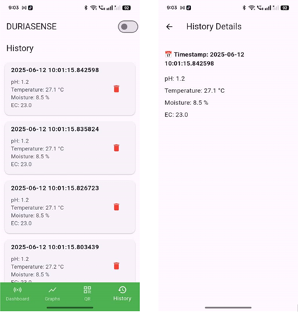

# DuriaSense – IoT-Based Durian Orchard Management System

DuriaSense is an **IoT-based smart agriculture system** developed to improve durian orchard management.  
It integrates **ESP32**, **RS485 Soil 4-in-1 sensor**, and a **Flutter mobile app** to monitor key soil parameters in real time:

- 🌡️ Temperature  
- 💧 Moisture  
- ⚡ Electrical Conductivity (EC)  
- 🧪 pH  

The system provides **real-time monitoring**, **local storage (SQLite)**, **QR code tree tagging**, and **notification alerts** to help farmers make better decisions about irrigation and soil treatment.  

## 📌 Features
- Real-time soil data via **Bluetooth Low Energy (BLE)**
- **Flutter mobile app** with intuitive dashboard
- **QR code generator & scanner** for tree identification
- **Alert notifications** when soil conditions are abnormal
- **Data history logs** stored locally with SQLite
- Export sensor data in **CSV** or **PDF** format
- Offline-first approach (works without internet)

## 📈 Agile Methodology

DuriaSense was developed using the **Agile methodology**, following iterative cycles:

1. **Plan Phase** – Defined objectives, selected ESP32, Soil 4-in-1 sensor, BLE, SQLite, and Flutter.  
2. **Design Phase** – Created system block & circuit diagrams, designed app UI wireframes.  
3. **Develop Phase** – Implemented hardware (ESP32 + RS485 + sensor) and software (Flutter app with BLE + SQLite).  
4. **Test Phase** – Verified sensor calibration, BLE connectivity, QR code functionality, and app notifications.  
5. **Deploy Phase** – Field-tested system in orchard-like conditions.  
6. **Review Phase** – Gathered user feedback and refined UI/UX.  
7. **Launch Phase** – Final prototype with full functionality delivered.  

## 📸 Screenshots (Flutter App UI)  

### Dashboard Interface

### Graph & Color Bars

### QR Code System

### Data History & Export

## 🚀 Setup & Usage

### 1. Hardware Setup
- Connect ESP32 with RS485 Soil 4-in-1 sensor
- Power sensor using 12V step-up converter
- Flash ESP32 with Arduino code from `/arduino_code`

### 2. Mobile App
- Install **Flutter SDK**
- Run `flutter pub get` to install dependencies
- Connect mobile device via Bluetooth to ESP32
- Launch app → view real-time data

### 3. Features in App
- Dashboard → view soil health
- Graphs → visualize changes
- QR Code → tag & scan trees
- Notifications → alerts for abnormal readings
- History → stored records with export to CSV/PDF

## 📦 Future Improvements
- 🌐 Cloud storage & remote monitoring (Firebase/AWS)  
- 👤 User authentication & multi-user support  
- 📊 Advanced analytics & trend prediction  
- 🔋 Optimized power management for field deployment
